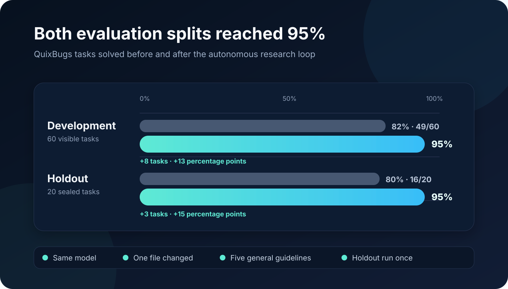
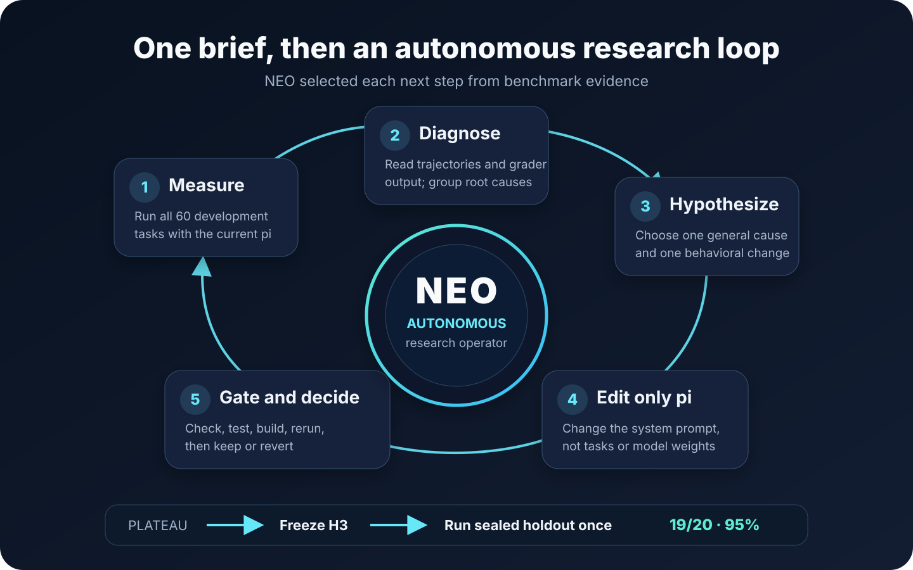

# An Autonomous Agent Improved pi from 82% to 95%

We gave NEO, our autonomous AI agent, one high-level brief: run an automated research loop and improve the pi coding agent on QuixBugs. NEO handled the research cycle itself. It ran the benchmark, inspected failures, formed hypotheses, edited pi's system prompt, verified each change, and decided when to stop.

The result was not a new model or a benchmark-specific patch. Five general instructions raised pi's development score from 49/60 to 57/60. A sealed holdout set then improved from 16/20 to 19/20.



Here is what this post covers:

- what NEO was allowed to change, and what stayed fixed;
- why correct code could still receive a score of zero;
- how three evidence-led hypotheses changed pi's behavior;
- why one sensible instruction caused a regression;
- how a single sealed holdout run tested whether the gain transferred.

## The result in one table

| Evaluation split | Before | After | Change |
| --- | ---: | ---: | ---: |
| Development, 60 tasks | 49/60, **82%** | 57/60, **95%** | **+8 tasks, +13 percentage points** |
| Sealed holdout, 20 tasks | 16/20, **80%** | 19/20, **95%** | **+3 tasks, +15 percentage points** |

The language model stayed fixed throughout: `openrouter/z-ai/glm-5.3-flash`. NEO changed one file, `pi/packages/coding-agent/src/core/system-prompt.ts`. It added five task-independent guidelines to the system prompt. It did not add solutions for individual QuixBugs problems.

The holdout set remained sealed until the development loop had stopped. NEO ran it once on the frozen final version.

## What NEO actually did on its own

This was not a chat session where a person studied every failure and told the agent what to try next. We asked NEO to run an auto-research loop that would make the current pi agent better on QuixBugs. It then completed the experimental workflow autonomously.

In each round, NEO:

1. ran pi on all 60 development tasks;
2. decoded pi's action traces and read the grader output;
3. grouped failures by their underlying cause;
4. proposed one general hypothesis;
5. changed only pi's system prompt;
6. ran type checks, tests, and a build;
7. measured the updated agent on the same development split;
8. kept or rejected the change from the evidence.



That distinction matters. An agent can automate a benchmark command without doing research. Here, NEO also interpreted failures, revised its own hypothesis after a regression, and stopped when further prompt changes risked overfitting.

The repository contains the full ledger in `experiment_notes.md`. The scored run outputs live under `quixbugs/jobs/` in the working experiment environment.

## Why QuixBugs exposed more than coding ability

QuixBugs contains 80 small bug-fixing tasks: 40 in Java and 40 in Python. The experiment used 60 tasks for development and reserved 20 as a sealed holdout set.

Each task had two important checks. First, the repaired program had to pass its functional tests. Second, the submitted fix had to differ from the original by exactly one line.

The second rule created an important trap. pi could identify the bug and produce working code, yet still score zero. For example, it sometimes edited the original file and then copied that file to the required output path. The two files were now identical, so the grader saw a zero-line difference.

This is less like answering a coding question and more like working inside a strict delivery process. A correct repair is not enough. The agent must also preserve the input, write to the exact destination, and satisfy the requested change format.

## The baseline showed one dominant failure

The fresh development baseline solved 49 of 60 tasks, or 82%. NEO inspected all 11 failures. It did not immediately add generic advice to “reason harder.”

It found three groups:

| Failure class | Tasks | What went wrong |
| --- | ---: | --- |
| Zero-line difference | 7 | Python code worked, but pi changed the input file and produced an output identical to it. |
| Incorrect Java repair | 3 | The one-line rule passed, but Java tests failed. |
| Incorrect Python repair | 1 | The Python functional tests failed. |

Seven of the 11 losses shared one behavioral cause. The largest opportunity was therefore not deeper algorithmic reasoning. It was reliable file handling.

This diagnosis shaped the first experiment. It also illustrates the value of reading an agent's trajectory, which is the record of its actions and reasoning during a task. Final scores say which tasks failed. Trajectories can explain why.

## H1 fixed the output-file trap

NEO's first hypothesis was direct: pi was mutating the supplied source before creating the requested result. General instructions about output fidelity should prevent that pattern.

It added two guidelines. One told pi to write the complete result to the exact output path named by the task. The other told pi to leave supplied input files unchanged unless the task explicitly requested an in-place edit.

The next development run solved 55/60 tasks, or 92%. That was six more successes than the baseline.

Because agent runs are stochastic, NEO did not treat one run as definitive. A three-attempt confirmation solved 164 of 180 task attempts, a 91% mean. The two apparent regressions from the first H1 run did not repeat. Only `java-minimum_spanning_tree` failed in all three attempts.

NEO kept H1. The evidence supported a repeatable gain, and the change addressed a general behavior rather than a list of benchmark cases.

## H2 improved verification but created a new bug

After H1, the remaining failures pointed toward minimal edits and weak self-checking. pi sometimes rearranged code when the task required one substituted line. It also relied on informal checks instead of the project's own tests.

NEO added two more guidelines:

- replace the faulty line in place instead of restructuring nearby code;
- before finishing, run the project's checks and compare the old and new files.

The result fell slightly from H1's single-run score of 55/60 to 54/60. It still remained five tasks above the baseline, but the drop required investigation.

NEO decoded all six failed trajectories. Three Java failures shared a new cause. When a direct `javac` command failed because of the package layout, pi created a `java_programs/` directory and copied or moved the source into it. The grader then found two files defining the same class and failed with `duplicate class`.

The verification instruction was reasonable in isolation. Its interaction with Java packaging made the submitted workspace invalid.

The other three failures had different causes. One was a network failure while Gradle downloaded a dependency. One was a genuine minimum-spanning-tree logic error. One Python repair returned the correct subsets in the wrong order.

A three-attempt H2 run scored 163/180, or a 90.6% mean. That was effectively level with H1's 91% mean. More importantly, the failure analysis exposed a precise and fixable side effect. NEO retained H2 as a stepping stone and targeted that side effect next.

## H3 removed the self-inflicted Java failure

NEO's third hypothesis constrained how pi verifies Java changes. The new guideline told pi not to move or duplicate the named source file. It could test in place or use a separate temporary directory, such as `/tmp`, without changing the submitted workspace.

The next development run solved 57/60 tasks, or 95%. Searches across the H3 grader output found zero `duplicate class` errors. The failure class introduced by H2 had disappeared.

H3 gained eight passing tasks relative to H2 and lost three. Those three losses came from previously inconsistent tasks, and none involved duplicate classes. The specific behavior targeted by H3 was gone.

NEO kept the change and froze this version. Across all three hypotheses, the final prompt had gained five general instructions in one TypeScript file.

## Why NEO stopped at 95%

The final development run still failed three tasks, but they did not form one clean cluster:

- `java-breadth_first_search` changed two lines despite the one-line contract;
- `java-shortest_paths` produced a Java repair that failed functional tests;
- `python-topological_ordering` repeated the earlier zero-line-difference behavior.

All three had varied across earlier runs. No single task-independent prompt rule clearly addressed them without risking the gains already made.

Stopping was part of the research process. Continuing to tune against three unrelated development failures could have fitted the prompt to noise. NEO froze pi at the H3 state rather than chasing a perfect development score.

## The sealed holdout tested generalization

An improvement on the tasks used during research can come from overfitting. The 20-task holdout provided a stronger test because NEO had not used those results to select its hypotheses.

The stored holdout baseline was 16/20, or 80%. On the frozen H3 prompt, the single final run solved 19/20, or 95%. All ten Java tasks passed, along with nine of ten Python tasks. The only failure was `python-possible_change`.

The holdout run took 16 minutes and 49 seconds. It used about 319,000 input tokens and 32,000 output tokens, with a recorded model cost of $0.0155.

The holdout does not prove that every coding benchmark will improve by 15 percentage points. It does show that the selected guidelines transferred to unseen QuixBugs tasks in this split. That is stronger evidence than the development score alone.

## What changed in pi

The five retained instructions can be summarized without the implementation syntax:

1. Write a requested result to the exact path and filename.
2. Preserve supplied inputs unless an in-place edit is explicitly requested.
3. For a one-line repair, replace that line without restructuring the file.
4. Run the project's own checks and inspect the final difference before finishing.
5. Verify without moving source files or creating duplicate package trees.

These are not QuixBugs answers. They are operating rules for working inside a repository with strict output contracts.

The improvement also did not come from changing the language model. The same model ran before and after. The measured variable was the guidance around how pi handled files, minimal changes, and verification.

## What this experiment demonstrates

First, agent failures are often procedural. Seven baseline tasks contained functionally correct Python, but file handling converted those repairs into zero scores.

Second, more verification is not automatically better. H2's instruction encouraged useful checking, especially on Python, but also caused pi to damage Java workspaces. The next gain came from studying that side effect, not from adding broader encouragement.

Third, autonomous research needs experimental discipline. NEO changed one factor at a time, used repeated runs when a result was ambiguous, preserved a sealed holdout, and stopped at a defensible plateau.

Finally, system prompts can be a meaningful engineering surface. In this experiment, five task-independent instructions improved both measured splits to 95%. The result is narrow and reproducible: it applies to this agent, model, benchmark, harness, and split. The evidence is still useful because every boundary is explicit.

## Reproduce the evaluation

Run the development split with:

```bash
cd quixbugs
PYTHONPATH=. ./.venv/bin/harbor run \
  -c dev.yaml --env-file .env -k 1 --job-name <name>
PYTHONPATH=. python3 summarize.py jobs/<name>
```

Run a holdout candidate with:

```bash
cd quixbugs
PYTHONPATH=. ./.venv/bin/harbor run \
  -c holdout.yaml --env-file .env -k 1 --job-name <name>
PYTHONPATH=. python3 summarize.py jobs/<name>
```

To match the recorded setup, install `fd-find` and set `PI_NO_LOCAL_LLM=1` for the pi test suite. Pass the `env-file` option with `.env` to Harbor. On the four-core experiment machine, jobs had to run sequentially. The full pi gate used three commands because one chained command exceeded the available timeout:

```bash
cd pi
npm run check
PI_NO_LOCAL_LLM=1 npm test
npm run build
```

The detailed evidence is in `experiment_notes.md`. The final implementation is in `pi/packages/coding-agent/src/core/system-prompt.ts`, frozen at the experiment's H3 revision.